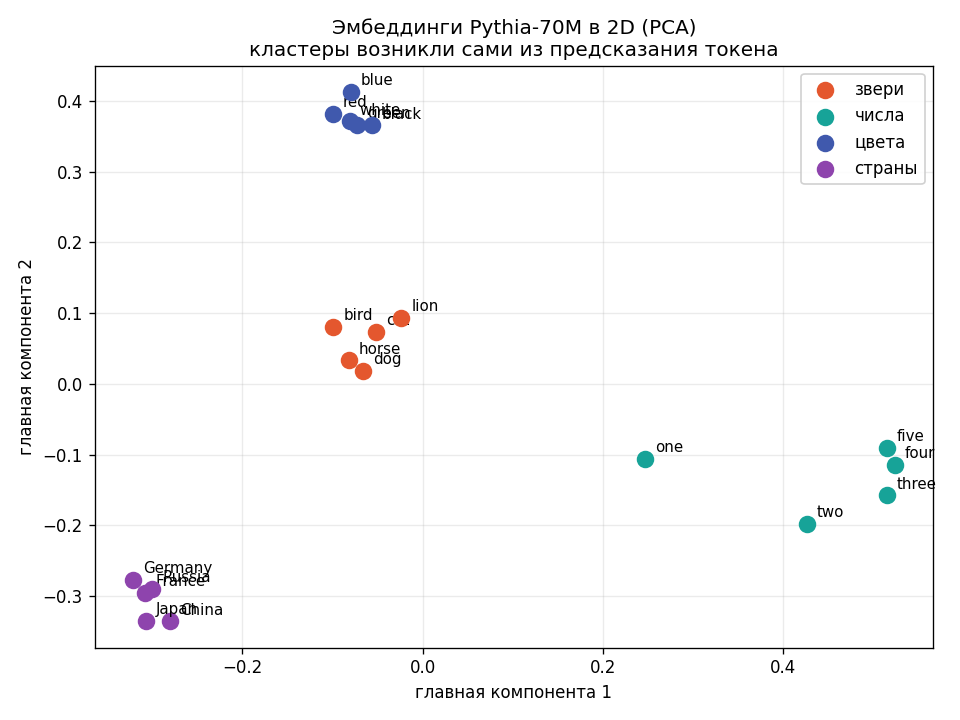
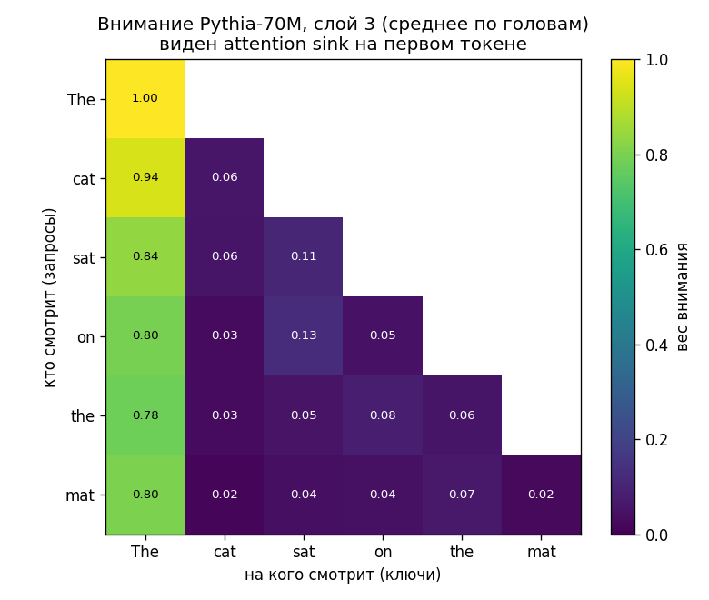
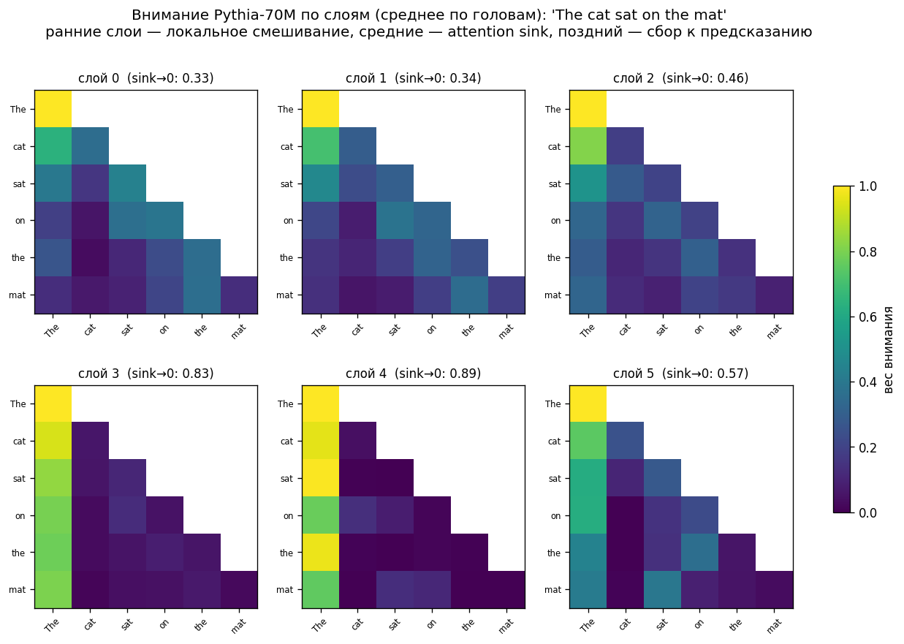
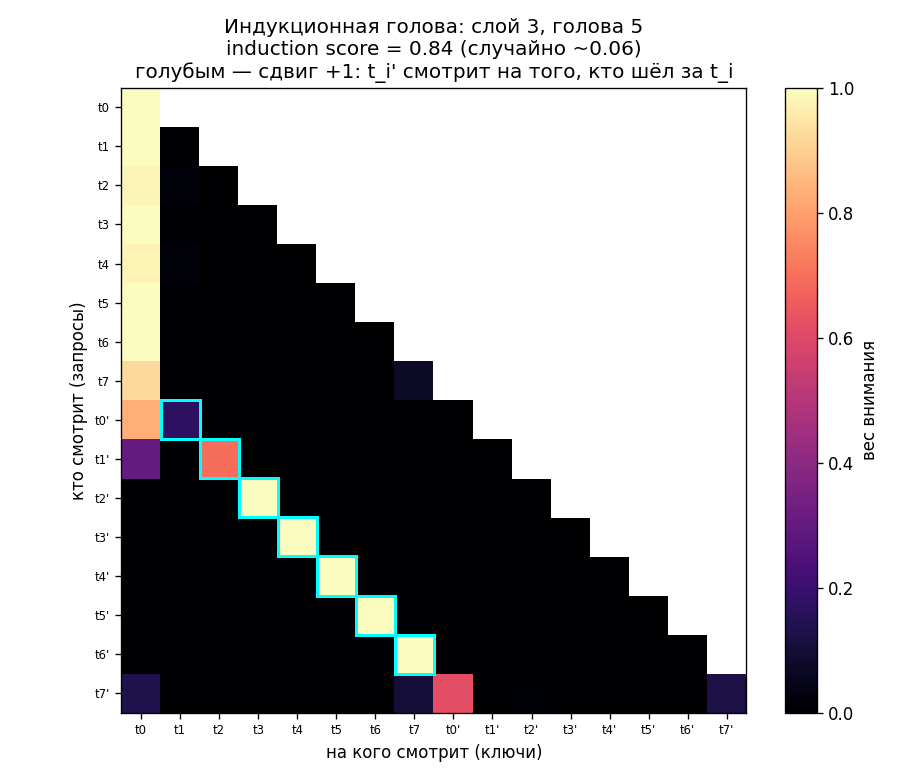
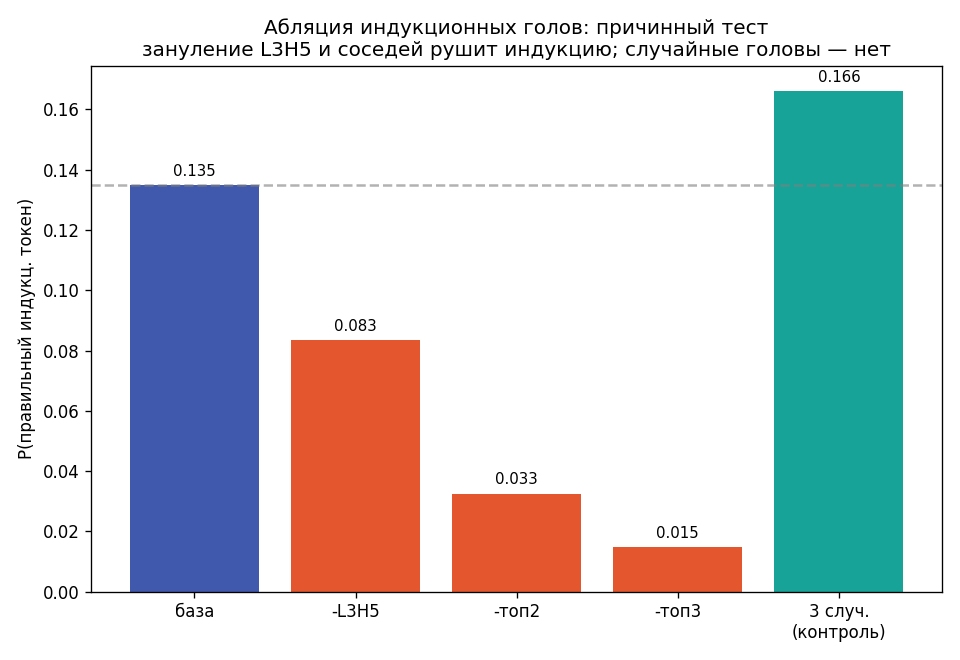
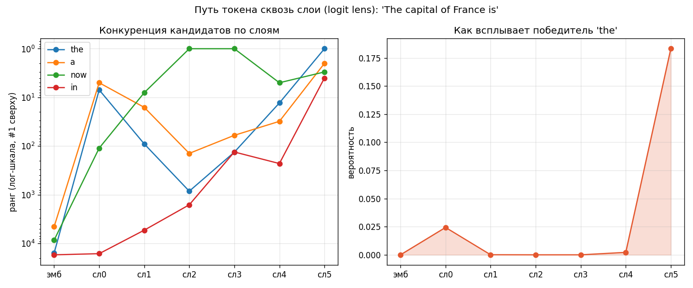

# Трансформер с нуля

Учебник о том, как мы построили нейросетевой фреймворк с нуля — от
производной одного числа до **компиляции в C+BLAS, мульти-GPU и запуска
настоящей LLM (Pythia-70M) с её RL-дообучением**. Только Python и numpy в ядре,
никакого PyTorch (он появляется лишь как эталон для сверки).

Каждая глава опирается на реальный код из этого репозитория. Идея в том, чтобы
не «использовать» нейросети как чёрный ящик, а **собрать всё по кирпичику** — от
autograd до RLHF — и на каждом шаге понимать, почему оно устроено именно так.

## Содержание
1. [Автоматическое дифференцирование](#глава-1-автоматическое-дифференцирование)
2. [От скаляра к тензорам](#глава-2-от-скаляра-к-тензорам)
3. [Обучение: loss и градиентный спуск](#глава-3-обучение-loss-и-градиентный-спуск)
4. [API как у PyTorch](#глава-4-api-как-у-pytorch)
5. [Свёртки и память (no_grad)](#глава-5-свёртки-и-память)
6. [Внимание (attention)](#глава-6-внимание-attention)
7. [Блоки трансформера](#глава-7-блоки-трансформера)
8. [Сборка GPT и генерация простых чисел](#глава-8-сборка-gpt-и-генерация-простых-чисел)
9. [Что выучила модель и где предел](#глава-9-что-выучила-модель-и-где-предел)
10. [Компиляция графа в C](#глава-10-компиляция-графа-в-c)
11. [GPU: device, диспетчер, CUDA](#глава-11-gpu-device-диспетчер-cuda)
12. [Настоящая LLM и обучение с подкреплением](#глава-12-настоящая-llm-и-обучение-с-подкреплением)
13. [Заглянуть внутрь: интерпретируемость](#глава-13-заглянуть-внутрь-интерпретируемость)
14. [Упражнения](#глава-14-упражнения)

---

## Глава 1. Автоматическое дифференцирование

> Файлы: `autograd.py`, `demo.py`

Обучение нейросети — это подбор её параметров так, чтобы ошибка (loss) была
минимальной. Чтобы понять, **в какую сторону** двигать каждый параметр, нужна
производная loss по этому параметру — градиент. Считать производные руками для
миллионов параметров невозможно, поэтому нужен механизм, который делает это
автоматически. Это и есть autograd.

### Граф вычислений

Главная идея: каждое число оборачиваем в объект, который помнит, **из чего** он
получился. Тогда любое выражение превращается в граф: листья — входы, корень —
результат.

```python
class Value:
    def __init__(self, data, _children=(), _op=""):
        self.data = data             # значение (forward)
        self.grad = 0.0              # производная результата по этому узлу
        self._backward = lambda: None   # как раздать градиент родителям
        self._prev = set(_children)  # родители (из чего получен этот узел)
        self._op = _op               # какая операция породила узел (для наглядности)
```

Ключевые поля: `data` — само число; `grad` — сюда backward запишет производную;
`_prev` — ссылки на родителей (рёбра графа); `_backward` — замыкание с локальным
правилом дифференцирования этой операции.

### Forward и локальные производные

Когда мы выполняем операцию, мы считаем результат **и** запоминаем, как
раздать градиент родителям. Сложение и умножение:

```python
def __add__(self, other):
    out = Value(self.data + other.data, (self, other), "+")
    def _backward():
        self.grad  += out.grad          # d(a+b)/da = 1 — градиент проходит как есть
        other.grad += out.grad          # d(a+b)/db = 1
    out._backward = _backward
    return out

def __mul__(self, other):
    out = Value(self.data * other.data, (self, other), "*")
    def _backward():
        self.grad  += other.data * out.grad   # d(a*b)/da = b
        other.grad += self.data  * out.grad   # d(a*b)/db = a
    out._backward = _backward
    return out
```

Это локальные правила: у сложения производная по каждому входу равна 1, у
произведения по `a` равна `b`, по `b` равна `a`. Множитель `out.grad` — это
градиент, «пришедший сверху» по цепному правилу.

### Построим граф на конкретном примере

Возьмём выражение `L = (a*b + c) * f` со значениями `a=2, b=-3, c=10, f=-2`:

```python
a = Value(2.0); b = Value(-3.0); c = Value(10.0); f = Value(-2.0)
e = a * b        # -6.0   (промежуточный узел)
d = e + c        #  4.0   (промежуточный узел)
L = d * f        # -8.0   (корень)
```

Каждая операция создала новый узел и запомнила родителей. Получилось дерево
(корень-результат сверху, листья-входы снизу):

```
└── *      L = -8.0            ← L = d * f
    ├── +      d = +4.0        ← d = e + c
    │   ├── input  c = +10.0
    │   └── *      e = -6.0    ← e = a * b
    │       ├── input  a = +2.0
    │       └── input  b = -3.0
    └── input  f = -2.0
```

Это и есть граф вычислений. Пока мы только посчитали `data` в каждом узле
(forward). Все `grad` пока равны 0.

### Backward и цепное правило

Теперь хотим `dL/d(всё)`. Идём от корня к листьям, применяя **цепное правило**:
если `L` зависит от `u`, а `u` от `x`, то `dL/dx = dL/du · du/dx`.

```python
def backward(self):
    # 1) Топологическая сортировка: узел идёт ПОСЛЕ своих родителей.
    topo, visited = [], set()
    def build(v):
        if v not in visited:
            visited.add(v)
            for child in v._prev:
                build(child)
            topo.append(v)
    build(self)

    # 2) Производная результата по самому себе равна 1 — точка старта.
    self.grad = 1.0

    # 3) От корня к листьям раздаём градиент по локальным правилам.
    for v in reversed(topo):
        v._backward()
```

Проследим, как градиент течёт по нашему примеру, шаг за шагом:

| узел | правило | вычисление | grad |
|------|---------|-----------|------|
| `L`  | старт | `dL/dL` | **+1.0** |
| `d`  | `L=d*f`, `dL/dd = f` | `1·(-2)` | **-2.0** |
| `f`  | `L=d*f`, `dL/df = d` | `1·(+4)` | **+4.0** |
| `c`  | `d=e+c`, проходит как есть | `-2·1` | **-2.0** |
| `e`  | `d=e+c`, проходит как есть | `-2·1` | **-2.0** |
| `a`  | `e=a*b`, `dL/da = b·dL/de` | `-2·(-3)` | **+6.0** |
| `b`  | `e=a*b`, `dL/db = a·dL/de` | `-2·(+2)` | **-4.0** |

После `L.backward()` каждый узел знает свой градиент:

```
└── *      data=-8.0 grad=+1.0
    ├── +      data=+4.0 grad=-2.0
    │   ├── input  data=+10.0 grad=-2.0     ← dL/dc
    │   └── *      data=-6.0 grad=-2.0
    │       ├── input  data=+2.0 grad=+6.0  ← dL/da
    │       └── input  data=-3.0 grad=-4.0  ← dL/db
    └── input  data=-2.0 grad=+4.0          ← dL/df
```

Проверим `dL/da` руками: `L = (a·b + c)·f`, значит `dL/da = f·b = (-2)·(-3) = 6`. ✓

Весь этот пример (с печатью дерева) — в файле `autograd_graph.py`:

```python
def print_tree(v, prefix="", is_last=True):
    op = v._op if v._op else "input"
    conn = "└── " if is_last else "├── "
    print(prefix + conn + f"{op:6s} data={v.data:+.1f} grad={v.grad:+.1f}")
    children = list(v._prev)
    child_prefix = prefix + ("    " if is_last else "│   ")
    for i, child in enumerate(children):
        print_tree(child, child_prefix, i == len(children) - 1)
```

### Почему `+=`, а не `=`

Два тонких момента, важных до самого конца:

- **Топологический порядок** гарантирует, что к моменту обработки узла его
  собственный `grad` уже полностью накоплен от всех «потомков».
- **`+=`, а не `=`**: один узел может входить в граф несколько раз, и вклады по
  всем путям **складываются** (правило производной суммы из многомерного
  анализа). Простейший пример — `y = a*a`:

```python
a = Value(3.0)
y = a * a          # a участвует и как левый, и как правый множитель
y.backward()
print(a.grad)      # 6.0 — это 2a; получилось как b·1 + a·1 = 3 + 3
```

Если бы в `_backward` стояло `=`, второй вклад затёр бы первый и вышло бы 3
вместо 6. Из-за накопления перед каждым новым backward градиенты надо
**обнулять** (`a.grad = 0`) — иначе они «протекут» из прошлой итерации обучения.

На этом этапе мы уже умеем считать градиенты любого выражения. В `demo.py`
показано, что они совпадают с математикой, и что простой градиентный спуск на
`(x-3)²` сходит `x` к 3.

---

## Глава 2. От скаляра к тензорам

> Файл: `tensor.py`

Скалярный `Value` нагляден, но непрактичен: для MNIST одна картинка — 784
числа, а их 60000. Решение — узел графа, который хранит не одно число, а
**массив numpy**. Математика backprop та же, операции — над матрицами.

### Матричное умножение

Линейный слой — это `X @ W`. Его производные:

```
C = A @ B   →   dA = dC · Bᵀ ,   dB = Aᵀ · dC
```

```python
def matmul(self, other):
    out = Tensor(self.data @ other.data, (self, other), "@")
    def _backward():
        ga = out.grad @ np.swapaxes(other.data, -1, -2)
        gb = np.swapaxes(self.data, -1, -2) @ out.grad
        self.grad  += _unbroadcast(ga, self.data.shape)
        other.grad += _unbroadcast(gb, other.data.shape)
    out._set_backward(_backward)
    return out
```

Транспонируем только две последние оси (`swapaxes(-1,-2)`), а не весь массив —
это сразу даёт **батчевое** матричное умножение, которое позже понадобится для
multi-head attention с тензорами формы `(B, heads, T, d)`.

### Broadcasting — главная новая тонкость

numpy умеет складывать массивы разной формы, «растягивая» меньший (например,
вектор-смещение `b` формы `(10,)` к матрице `(N, 10)`). При backward градиент
надо «сжать» обратно, просуммировав по растянутым осям:

```python
def _unbroadcast(grad, shape):
    while grad.ndim > len(shape):          # убрать добавленные оси
        grad = grad.sum(axis=0)
    for axis, dim in enumerate(shape):     # сжать растянутые (size==1) оси
        if dim == 1:
            grad = grad.sum(axis=axis, keepdims=True)
    return grad
```

Это незаметная, но критичная функция: без неё градиенты смещений и любых
broadcast-операций были бы неверны.

### Граф тензорных операций целиком

Соберём из этих операций один «слой сети» и проследим значения и градиенты на
каждом шаге. Возьмём `L = sum(relu(X @ W + b))` на маленьких матрицах
(файл `tensor_graph.py`):

```python
X = Tensor([[1, 2, 3], [4, 5, 6]])      # (2, 3)
W = Tensor([[1, 0], [0, 1], [1, 1]])    # (3, 2)
b = Tensor([-6, -2])                    # (2,)

Z = X @ W       # (2, 2)  матричное умножение
H = Z + b       # (2, 2)  + смещение (broadcasting по строкам)
A = H.relu()    # (2, 2)  нелинейность
L = A.sum()     # скаляр
```

Граф (форма тензора в каждом узле):

```
└── sum      shape=()          ← L
    └── relu     shape=(2, 2)  ← A
        └── +        shape=(2, 2)  ← H = Z + b
            ├── @        shape=(2, 2)  ← Z = X @ W
            │   ├── X        shape=(2, 3)
            │   └── W        shape=(3, 2)
            └── b        shape=(2,)
```

**FORWARD** (значения снизу вверх):

```
Z = X @ W    = [[ 4,  5],      H = Z + b   = [[-2, 3],      A = relu(H) = [[0, 3],
                [10, 11]]                      [ 4, 9]]                     [4, 9]]
L = sum(A) = 16
```

**BACKWARD** (градиенты сверху вниз, старт `dL/dL = 1`):

```
dL/dA = [[1, 1],      dL/dH = [[0, 1],      dL/dZ = [[0, 1],
         [1, 1]]               [1, 1]]               [1, 1]]

dL/db = [1, 2]        dL/dX = [[0, 1, 1],   dL/dW = [[4, 5],
                               [1, 1, 2]]            [5, 7],
                                                     [6, 9]]
```

Здесь наглядно видны три вещи, ради которых всё и строилось:

- **ReLU обрезает градиент.** На forward `H[0,0] = -2 < 0`, поэтому
  `dL/dH[0,0] = 0` — через «мёртвый» нейрон градиент не проходит.
- **Broadcasting сворачивается суммой.** `b` формы `(2,)` растянулось до `(2,2)`,
  значит его градиент — сумма `dL/dH` по строкам: `[0+1, 1+1] = [1, 2]`. Это и
  делает `_unbroadcast`.
- **Matmul раздаёт по своим правилам:** `dL/dX = dZ · Wᵀ`, `dL/dW = Xᵀ · dZ`.

Проверить можно так: `L = sum(relu(X@W + b))`, и, например, `dL/db[1]` — это
сколько элементов второго столбца `H` положительны (оба: 3 и 9) → `2`. ✓

Запустить и увидеть все матрицы целиком: `python3 tensor_graph.py`.

---

## Глава 3. Обучение: loss и градиентный спуск

> Файл: `mnist.py`

### Softmax + кросс-энтропия

Для классификации на 10 цифр выход сети (логиты) превращают в вероятности
(softmax) и сравнивают с правильным ответом (кросс-энтропия). По отдельности
softmax и log численно неустойчивы, поэтому их **совмещают**, и градиент
получается простым и стабильным:

```
∂loss/∂логиты = (p − y_onehot) / N
```

где `p` — предсказанные вероятности, `y_onehot` — правильный класс, `N` —
размер батча. Эту же формулу мы потом переиспользуем в трансформере.

### Цикл обучения

```python
logits = model(xb)              # 1. forward
loss = criterion(logits, yb)    # 2. ошибка
optimizer.zero_grad()           # 3. обнулить градиенты
loss.backward()                 # 4. backward — посчитать ∂loss/∂параметры
optimizer.step()                # 5. шаг: p -= lr * p.grad
```

Эти пять строк — сердце обучения **любой** сети в этом репозитории, от MLP до
GPT. Двухслойный перцептрон `784→128→10` так достигает ~97% на MNIST.

---

## Глава 4. API как у PyTorch

> Файлы: `nn.py`, `optim.py`, `api_demo.py`

Чтобы не держать вручную `W1, b1, W2, b2`, вводим «кубики»-слои. Базовый класс
`Module` рекурсивно собирает параметры из своих полей — как `torch.nn.Module`:

```python
class Module:
    def parameters(self):
        return [p for _, p in self.named_parameters()]
    def __call__(self, *a):
        return self.forward(*a)
```

`Linear`, `ReLU`, `Sequential`, `CrossEntropyLoss` повторяют имена и конвенции
PyTorch (веса формы `(out, in)`, `x @ weight.T + bias`). Оптимизаторы `SGD`
(с моментом) и `Adam` имеют интерфейс `step()` / `zero_grad()`.

В итоге наш код модели **дословно совпадает** с PyTorch — отличаются только
строки `import` (см. `api_demo.py`). Это не косметика: это значит, что мы
правильно поняли, как устроен настоящий фреймворк.

---

## Глава 5. Свёртки и память

> Файлы: `tensor.py`, `mnist_conv.py`

### Свёртка через im2col

Свёртка — «приложить ядро к каждому окну изображения». Наивно это вложенные
циклы. Трюк **im2col** разворачивает все окна в столбцы одной матрицы, и тогда
свёртка = одно матричное умножение (быстро считает BLAS). Обратная операция
`col2im` нужна в backward. На этом построены `conv2d`, `maxpool2d`. CNN из двух
свёрток даёт ~97–99% на MNIST.

### Режим no_grad

Каждая операция строит граф для backward: узел хранит ссылки на родителей,
замыкание `_backward` и массив `grad`. При обучении это нужно, но при
**инференсе** — лишняя память: за один проход в RAM живут все промежуточные
карты батча. У нас это разгоняло пик до **3.2 ГБ** и роняло процесс по OOM.

Решение — `no_grad` (как `torch.no_grad()`):

```python
class no_grad:
    def __enter__(self):  global _grad_enabled; _grad_enabled = False
    def __exit__(self, *e): _grad_enabled = True
```

Под ним `__init__` не выделяет `grad`, а `_set_backward` не регистрирует
замыкание и не запоминает родителей. Промежуточные тензоры сразу освобождаются
сборщиком мусора. Результат: тот же инференс при пике **0.74 ГБ**.

Этот же приём важен для трансформера: генерация запускает forward тысячи раз,
и без `no_grad` мы бы строили (и не освобождали) тысячи графов.

### Освобождение графа после backward

Есть и вторая, более коварная утечка — уже при **обучении**. Замыкание
`_backward` каждого узла ссылается на свой же узел (`out._backward` захватывает
`out`). Получается **ссылочный цикл**, который обычный счётчик ссылок Python не
разрывает — освободить память может только сборщик циклов, а он не успевает.
На маленьких графах (простые числа, `T=5`) это незаметно, но на char-LM с
контекстом `T=32` память росла ~40 МБ за итерацию и убивала процесс по OOM за
полсотни шагов (RSS 2.1 ГБ уже на 50-й итерации).

Решение — то же, что делает PyTorch по умолчанию: **освобождать граф сразу после
backward**. В конце `backward()` проходим по всем узлам и разрываем циклы:

```python
for v in reversed(topo):
    v._backward()
# граф больше не нужен — рвём циклы, чтобы узлы освободились сразу
for v in topo:
    v._backward = _noop
    v._prev = _EMPTY
```

`.grad` и `.data` при этом сохраняются (их держит тот, кому они нужны —
оптимизатор через `p.grad`). После фикса память на char-LM стала стабильной:
**277 МБ** вместо роста до OOM. Это ровно поведение «граф живёт один backward»
из настоящих фреймворков (в PyTorch его продлевают флагом `retain_graph=True`).

### float32 — дешёвый ×2

Ещё один рычаг: тип чисел. По умолчанию движок считал в `float64`, но нейросети
прекрасно обучаются в `float32` (это дефолт в PyTorch), а он вдвое меньше по
памяти и быстрее по вычислениям. Мы сделали тип движка настраиваемым
(`_dtype`, по умолчанию `np.float32`) и заодно убрали места, где numpy молча
повышал точность обратно до `float64` (например, `np.zeros` в `im2col`).
Замер на char-LM: **1.68× ускорения** (140 → 84 мс/батч). Не ровно вдвое —
часть времени это фиксированные Python-накладные, не зависящие от типа.

Тонкость: в `float32` конечно-разностная проверка градиента слишком шумна
(порядок `1e-3`). Поэтому для строгой сверки движок временно переключают в
`float64` (`set_dtype(np.float64)`) — математика та же, меняется только
точность чисел.

---

## Глава 6. Внимание (attention)

> Слой `MultiheadAttention` в `nn.py`

Дошли до главного. Свёртка хороша для картинок, где важны соседи. Но для
**последовательностей** (текст, цифры числа) нужна операция, в которой любая
позиция может «посмотреть» на любую другую. Это и есть self-attention.

### Интуиция: запрос, ключ, значение

Представьте, что каждая позиция последовательности задаёт **вопрос** (query):
«какая информация мне нужна?» Каждая позиция также выставляет **ключ** (key):
«вот что у меня есть» — и **значение** (value): «вот что я отдам, если подойду».

Позиция сравнивает свой запрос со всеми ключами; где совпадение сильнее, оттуда
берёт больше значения. Формально:

```
Attention(Q, K, V) = softmax( Q · Kᵀ / √d ) · V
```

- `Q · Kᵀ` — матрица «похожести» каждой позиции на каждую (скалярные
  произведения запросов и ключей).
- `/ √d` — нормировка, чтобы значения не разъезжались при большой размерности
  (иначе softmax становится почти ступенькой и градиенты затухают).
- `softmax(...)` по строке — превращает похожести в **веса внимания** (сумма 1).
- `· V` — взвешенное среднее значений: каждая позиция собирает информацию с тех,
  на кого «обратила внимание».

Q, K, V получаются из входа линейными проекциями `Wq, Wk, Wv` — обычными
`Linear`. То есть сеть **сама учится**, какие запросы и ключи формировать.

### Multi-head: несколько взглядов сразу

Одной матрицы внимания мало: разные «отношения» между позициями хочется ловить
независимо. Поэтому вектор каждой позиции режут на `n_heads` частей (голов), и
внимание считают в каждой голове отдельно, а потом склеивают:

```python
def forward(self, x):
    B, T, D = x.shape
    Q = self._split_heads(self.Wq(x), B, T)   # (B, heads, T, d_head)
    K = self._split_heads(self.Wk(x), B, T)
    V = self._split_heads(self.Wv(x), B, T)

    scores = (Q @ K.mT) * (1.0 / np.sqrt(self.d_head))   # (B, heads, T, T)
    weights = scores.softmax(axis=-1)
    context = weights @ V                                 # (B, heads, T, d_head)

    context = context.swapaxes(1, 2).reshape(B, T, D)     # склеить головы
    return self.Wo(context)                               # финальная проекция
```

Здесь нам пригодилось всё, что мы строили: батчевый `@`, `softmax` как
отдельная autograd-операция, `swapaxes`/`mT`, `reshape`. Backward через всё это
считается автоматически — мы лишь скомпоновали примитивы.

### Каузальный маск

Для **генерации** позиция не должна заглядывать в будущее (иначе при обучении
она «подсмотрит» ответ). Запрещаем это, добавляя `−∞` выше главной диагонали
матрицы похожести — после softmax такие веса станут нулевыми:

```python
if self.causal:
    mask = np.triu(np.full((T, T), -1e9), k=1)
    scores = scores + Tensor(mask)
```

Именно каузальный маск превращает энкодер в **декодер** (GPT-стиль).

### softmax как операция autograd

Чтобы внимание было обучаемым, softmax должен уметь backward. Его якобиан:

```
s = softmax(x);   dx = s ⊙ ( g − Σ(g ⊙ s) )
```

```python
def softmax(self, axis=-1):
    z = self.data - self.data.max(axis=axis, keepdims=True)
    e = np.exp(z); p = e / e.sum(axis=axis, keepdims=True)
    out = Tensor(p, (self,), "softmax")
    def _backward():
        s = (out.grad * p).sum(axis=axis, keepdims=True)
        self.grad += p * (out.grad - s)
    out._set_backward(_backward)
    return out
```

---

## Глава 7. Блоки трансформера

> Слои `LayerNorm`, `TransformerEncoderLayer` в `nn.py`

Один слой внимания — ещё не трансформер. Вокруг него собирают блок из четырёх
ингредиентов.

### 1. Остаточные связи (residual)

`x = x + Layer(x)`. Слой учится не «всему сигналу», а **поправке** к нему.
Это даёт градиенту короткий путь напрямую (через `+`) и позволяет строить
глубокие сети, которые иначе не обучались бы.

### 2. LayerNorm

Нормирует вектор каждой позиции к среднему 0 и дисперсии 1, затем масштабирует
обучаемыми `γ` (weight) и `β` (bias). Стабилизирует обучение. Собран
композицией примитивов — backward делает autograd:

```python
def forward(self, x):
    mean = x.mean(axis=-1, keepdims=True)
    xc = x - mean
    var = (xc * xc).mean(axis=-1, keepdims=True)
    norm = xc / (var + self.eps) ** 0.5
    return norm * self.weight + self.bias
```

(Здесь нам понадобились `__pow__` и `__truediv__`, добавленные в `Tensor`.)

### 3. Feed-forward (MLP)

После внимания — небольшой двухслойный MLP `Linear → ReLU → Linear`, применяемый
к каждой позиции независимо. Внимание **смешивает** информацию между позициями,
а MLP **обрабатывает** её внутри позиции. Они дополняют друг друга.

### 4. Собранный блок (pre-norm)

```python
def forward(self, x):
    x = x + self.attn(self.norm1(x))   # внимание + residual
    x = x + self.ff(self.norm2(x))     # MLP + residual
    return x
```

Вариант **pre-norm** (LayerNorm перед под-слоем) устойчивее при обучении, чем
исходный post-norm. `TransformerEncoder` — это просто стопка таких блоков.

---

## Глава 8. Сборка GPT и генерация простых чисел

> Файл: `primes.py`

Соберём из блоков авторегрессионную модель (мини-GPT) и поставим ей задачу:
**генерировать простые числа**.

### Постановка задачи

Число записываем как последовательность из 5 десятичных цифр (с ведущими
нулями): `7 → [0,0,0,0,7]`, `9973 → [0,9,9,7,3]`. Модель — языковая на уровне
цифр: предсказывает следующую цифру по предыдущим. Обучаемся на всех простых
числах `< 100000` (их 9592).

Вход и цель сдвинуты на одну позицию:

```
вход:  [BOS, d0, d1, d2, d3]
цель:  [ d0, d1, d2, d3, d4]
```

### Модель

```python
class PrimeLM(nn.Module):
    def __init__(self, d_model=64, n_heads=4, n_layers=2):
        super().__init__()
        self.tok_emb = nn.Embedding(VOCAB, d_model)     # вектор каждой цифры
        self.pos_emb = nn.Embedding(SEQ_LEN, d_model)   # вектор каждой позиции
        self.decoder = nn.TransformerEncoder(d_model, n_heads, n_layers,
                                             causal=True)   # ← каузальный!
        self.head = nn.Linear(d_model, 10)              # предсказать цифру 0..9

    def forward(self, tokens):
        T = tokens.shape[1]
        x = self.tok_emb(tokens) + self.pos_emb(np.arange(T))
        x = self.decoder(x)
        return self.head(x)        # (B, T, 10)
```

Два вида эмбеддингов: **токенный** (что за цифра) и **позиционный** (на каком
месте). Без позиционного трансформер не различал бы порядок — для него вход без
позиций это мешок токенов.

### Авторегрессионная генерация

Генерируем цифра за цифрой, каждый раз подавая уже сгенерированный префикс и
сэмплируя следующую цифру из softmax. Всё под `no_grad`:

```python
tokens = [[BOS]]
for _ in range(SEQ_LEN):
    logits = model(Tensor(tokens))     # причинно зависит только от левого контекста
    probs = softmax(logits[:, -1, :])  # распределение следующей цифры
    next_digit = sample(probs)
    tokens.append(next_digit)
```

### Результаты

После 15 эпох (≈3 минуты на CPU):

```
доля простых среди сгенерированных: 0.36   (случайно было бы ~0.10)
распределение последней цифры: [0, 825, 0, 787, 0, 2, 0, 703, 1, 682]
примеры: 7, 13, 19, 43, 53, 61, 73, 139, 157, 179, 191, 263, 521, ...
```

Два наблюдения, которые стоит прочувствовать:
- Доля простых среди сгенерированных чисел — **в 3.7 раза выше случайной**.
- Последняя цифра почти всегда **1, 3, 7 или 9** — на 0,2,4,6,8 нули. Модель
  **сама** вывела из данных, что простые `>5` не оканчиваются на чётную цифру
  или 5 (иначе делились бы на 2 или 5). Никто ей этого правила не сообщал.

### Тот же GPT — но на тексте

Самое приятное: чтобы обучить модель на **естественном языке**, менять почти
нечего. Цифры → символы, длина 5 → контекст 32, словарь 10 → 65 символов.
Архитектура (`CharGPT` в `text.py`) — буквально та же, что порождала простые
числа: эмбеддинги токена и позиции → каузальный `TransformerEncoder` →
`LayerNorm` → `Linear` на размер словаря.

Обучаем на «tiny Shakespeare» (1.1 млн символов). Как модель постепенно
осваивает язык, видно по образцам генерации:

```
iter  250 (loss 2.94):  the tond onde r thdichann ... th s tho t hethaloif
iter 1000 (loss 2.22):  Of Buthe wi; Himke maired ys so brimest of her pather...
iter 3000 (loss 1.82):  PLADY:
                        Thy EnON pree and itle shall is for her of thim begain
                        Manitione all the sown roles thich of you hast;
                        How hre ussurnseatin with may I wi
```

За ~14 минут на CPU (160k параметров, float64) модель выучила:
- **формат пьесы** — имя заглавными, двоеточие, реплика с новой строки;
- **настоящие слова** — `the, shall, is, for, her, all, of, you, how, with, may`;
- **морфологию** — апострофы (`I'll`), правдоподобные окончания, чередование
  гласных и согласных.

Связного смысла нет — модель крошечная, а движок учебный. Но это тот же
механизм, что и в больших LLM: предсказание следующего токена по контексту.
Разница с GPT-4 — только в масштабе (параметры, данные, вычисления), не в идее.

---

## Глава 9. Что выучила модель и где предел

Важно быть честным о том, что произошло. Модель **не** научилась проверять
простоту — это и невозможно вывести из одних цифр. Она выучила, как простые
числа **выглядят статистически**:
- последняя цифра ∈ {1,3,7,9};
- распределение старших разрядов примерно как у реальных простых;
- более слабые сигналы делимости.

Поэтому среди сгенерированных чисел простых становится сильно больше, чем при
случайной генерации, но не 100%: модель уверенно отсекает «очевидно составные»
(делящиеся на 2, 5, отчасти 3) и теряется на тех, чья составность по цифрам не
видна (например, произведение двух больших простых).

Это и есть точная иллюстрация того, **что умеют и чего не умеют** языковые
модели: они блестяще ловят статистические закономерности данных, но не
исполняют точные алгоритмы (здесь — проверку простоты), если те не сводятся к
таким закономерностям.

В классификационном варианте (`primes.py` в режиме классификации) тот же
трансформер, отличая простые от составных, доходил до ~87% — и тоже за счёт
правил делимости, а не «понимания» простоты.

### А можно ли получить 100%?

Можно — но только на **обучающей** выборке, и это очень поучительно. Файл
`primes_memorize.py`.

Ключевое наблюдение: цифры **однозначно** задают число, поэтому в датасете
«последовательность цифр → простое/составное» нет противоречий (одинаковый вход
всегда имеет одну метку). Значит выборка идеально **разделима**, и модель с
достаточной ёмкостью может её просто **запомнить**. Мы взяли трансформер
покрупнее (≈337k параметров, 3 слоя) и переобучили его на числах < 10000:

```
эпоха   5:  train=0.846  test=0.817
эпоха  40:  train=0.965  test=0.760
эпоха  65:  train=0.996  test=0.738
эпоха  85:  train=1.000  test=0.728   ← 100% на train!
```

Точность на train дошла ровно до **100%**, а на отложенном тесте застряла на
**~73%** и даже проседала по ходу переобучения. Это классический **overfitting**
во всей красе:

- **train → 100%** — модель запомнила ответы для конкретных обучающих чисел.
- **test → плато** — на новых числах запоминание не помогает, работают только
  выученные признаки делимости.

Мораль: «100% точности» почти ничего не значит без указания, на **каких**
данных. 100% на train — это может быть просто зубрёжка. Ценно только качество на
**новых** данных (обобщение), а его точной проверкой простоты не возьмёшь.
Именно поэтому в реальном ML всегда держат отдельный тест и следят за разрывом
train–test.

---

## Глава 10. Компиляция графа в C

> Файл: `compile_graph.py`

Наш движок **динамический**: граф строится заново на каждом проходе, а обход
идёт через Python-объекты и замыкания. Это гибко, но медленно — на каждую
операцию накладные расходы интерпретатора. Настоящие фреймворки умеют
**компилировать** граф (torch.compile, XLA, TVM): один раз превратить его в
статический машинный код без Python. Сделаем это в самом наглядном виде — для
скалярного графа сгенерируем C.

### Идея

Граф — это, по сути, уже готовая программа в форме
[SSA](https://ru.wikipedia.org/wiki/SSA) (каждый узел присваивается один раз).
Осталось её напечатать: топологический порядок → по одной строке C на узел.

```c
double v0 = 0.7;
double v1 = -1.3;
double v2 = v0 * v1;       // a * b
double v3 = 2.0;
double v4 = v2 + v3;       // + c
double v5 = tanh(v4);
double v6 = pow(v0, 2);    // a ** 2
double v7 = v5 * v6;       // L
```

Backward генерируется так же прямолинейно — из тех же локальных правил, что и в
`autograd.py`, но в обратном топологическом порядке:

```c
g7 = 1.0;
g5 += (v6) * g7;                       // *
g6 += (v5) * g7;
g0 += (2 * pow(v0, 2 - 1)) * g6;       // a**2 -> вклад в grad a
g4 += (1.0 - v5*v5) * g5;              // tanh
g2 += g4;  g3 += g4;                   // +
g0 += (v1) * g2;                       // a*b -> ещё вклад в grad a
g1 += (v0) * g2;
```

Обратите внимание на `g0`: `a` входит в выражение дважды (в `a*b` и в `a**2`),
и C-код накапливает оба вклада через `+=` — ровно тот же принцип суммирования
градиента по путям, что и в главе 1.

### Кодогенерация

Каждая операция → одно C-выражение:

```python
def _forward_expr(node, name):
    op, ins = node._op, node._inputs
    if op == "+":  return " + ".join(name[c] for c in ins)
    if op == "*":  return " * ".join(name[c] for c in ins)
    if op.startswith("**"):  return f"pow({name[ins[0]]}, {op[2:]})"
    if op == "tanh":  return f"tanh({name[ins[0]]})"
    if op == "relu":  return f"fmax(0.0, {name[ins[0]]})"
```

Дальше `compile_and_run` пишет `.c`, вызывает `gcc -O2`, запускает бинарник и
парсит вывод. Результат сверяется с Python-версией:

```
Python:  forward = 0.39047029066,  grad a = 0.883133814652
C:       forward = 0.39047029066,  grad a = 0.883133814652
Совпадение Python и C: OK ✓   (расхождение < 1e-12)
```

### Честно о масштабе

Здесь скомпилирован **скалярный** граф — это идеальная учебная модель
компиляции. Для тензоров узкое место другое: большие матричные умножения, а их
numpy и так выполняет через BLAS (тот же оптимизированный C). Там выигрыш даёт
не наивный цикл, а **слияние** элементных операций (fusion) и вызовы той же
BLAS — но сама идея «динамический граф → статический код» ровно такая же, как в
этих восьми строках C.

### Тензорный граф → C + BLAS

> Файл: `compile_blas.py`

Доведём идею до тензоров. `compile_blas.py` компилирует forward-граф (вход, `@`,
`+` со смещением, `relu`, `tanh`) в C, где:
- каждое `@` → вызов `cblas_sgemm` (тот самый OpenBLAS, что и под numpy);
- поэлементные операции → циклы (их можно сплавлять — fusion).

Граф `Y = relu(X @ W1 + b1) @ W2 + b2` превращается в:

```c
cblas_sgemm(CblasRowMajor,CblasNoTrans,CblasNoTrans, 4,16,8, 1.0f, t0,8, t1,16, 0.0f, t2,16);
for (int i=0;i<64;i++) t4[i] = t2[i] + t3[i%16];   // + bias (broadcast)
for (int i=0;i<64;i++){ float x=t4[i]; t5[i]=x>0?x:0; }  // relu
cblas_sgemm(CblasRowMajor,CblasNoTrans,CblasNoTrans, 4,5,16, 1.0f, t5,16, t6,5, 0.0f, t7,5);
```

Выход совпадает с numpy до `~5e-6` (точность `float32`). Замер (MLP
32→256→64): наш Python-движок **0.114 мс**, C+BLAS **0.098 мс** — ускорение
скромные **1.2×**. И это честный результат: forward тут почти целиком в двух
`sgemm`, а они — тот же BLAS в обоих случаях. Выигрыш даёт только снятие
Python-обвязки; на графах с множеством мелких операций (LayerNorm, softmax,
масштабирование) он был бы заметнее. Матричное умножение **не переписывается** —
именно так устроены torch.compile и XLA: BLAS/cuBLAS для больших умножений,
слитый сгенерированный код для всего остального.

### Профилирование: куда уходит время

Раз мы сами генерируем C, мы можем обернуть **каждую операцию** таймером и
получить точную разбивку (режим `profile=True` в `compile_blas.py`). Трёхслойный
MLP `256→512→512→128`:

```
операция                  мс/проход   доля
matmul 64x256@256x512       0.270     25.8%
add-bias [64x512]           0.029      2.8%
relu [32768]                0.019      1.8%
matmul 64x512@512x512       0.518     49.4%
add-bias [64x512]           0.025      2.4%
relu [32768]                0.019      1.8%
matmul 64x512@512x128       0.158     15.0%
add-bias [64x128]           0.010      0.9%
ВСЕГО                       1.047
```

Три `matmul` съедают **90%** — и все они в BLAS. Поэлементные `add`/`relu` дёшевы
(~10%), но именно их **слияние** убирает лишние проходы по памяти (сейчас после
каждого gemm мы читаем и пишем весь буфер трижды: bias, relu, следующий gemm).

Почему не обычный профайлер? `gprof` на этом же бинарнике показывает **100% в
`main`** и ничего больше: все операции заинлайнены в `main`, а время внутри
`libopenblas` ему не видно (библиотека собрана без `-pg`). Универсальный
профайлер здесь слеп — а «графовый», который знает про операции, даёт точную
картину. (Полноценно увидел бы всё и сэмплирующий `perf`, но он есть не везде.)

### Fusion — слияние поэлементных операций

Профиль показал: после каждого gemm мы отдельными циклами прибавляем смещение и
применяем relu — это **два прохода по памяти** (прочитать буфер, записать;
прочитать, записать). Их можно слить в **один** проход: прочитать элемент один
раз, применить всю цепочку в регистре, записать только итог. Это и есть fusion —
ключевая оптимизация torch.compile / XLA (режим `fuse=True` в `compile_blas.py`).

Компилятор находит цепочки поэлементных операций, где промежуточный результат
нужен только следующей операции (единственный потребитель), и генерирует один
цикл. Было три оператора (`+bias`, `relu`) с промежуточным буфером — стало:

```c
for (int i=0;i<512;i++){ float v=t2[i]; v+=t3[i%64]; v=v>0?v:0; t5[i]=v; }
```

Промежуточный буфер `H` исчез вовсе — значение живёт в регистре `v`. Результат
идентичен (сверка с numpy `~5e-6`), а в профиле два оператора схлопнулись в один:

```
без fusion:   + [32768]  0.026 мс  +  relu [32768]  0.017 мс   (два прохода)
c fusion:     fused +→relu [32768]  0.027 мс                    (один проход)
```

Поэлементная часть ужалась примерно на треть (два прохода → один). На нашем
MLP это малая доля общего времени (всё решают matmul-и), но для memory-bound
операций — а в трансформере это LayerNorm, softmax, остаточные связи — именно
fusion даёт основной выигрыш компиляции. Матричное умножение при этом
по-прежнему уходит в BLAS без изменений.

### Компиляция backward

Forward — половина дела; для обучения нужен и обратный проход. Его тоже можно
скомпилировать (`compile_backward` в `compile_blas.py`). Ключевое наблюдение:
**градиенты matmul — это снова matmul**, только с транспонированием:

```
Z = X @ W   →   dX = dZ · Wᵀ ,   dW = Xᵀ · dZ
```

А значит — снова `cblas_sgemm`, просто с флагом `CblasTrans`:

```c
// dX += dZ @ Wᵀ
cblas_sgemm(CblasRowMajor, CblasNoTrans, CblasTrans, 6,12,20, 1.0f, g2,20, t1,20, 1.0f, g0,12);
// dW += Xᵀ @ dZ
cblas_sgemm(CblasRowMajor, CblasTrans, CblasNoTrans, 12,20,6, 1.0f, t0,12, g2,20, 1.0f, g1,20);
```

Поэлементные градиенты — циклы по тем же правилам, что в главе 1: у `relu`
маска `(выход>0)`, у `+` смещения — сумма по строкам, у остаточной связи —
проход насквозь. Каждый узел получает буфер градиента `g{i}` (обнулён), выход
засевается единицами, дальше идём в обратном топологическом порядке.

Компилятор строит forward **без** fusion (промежуточные активации нужны для
backward — их надо сохранить). Сверка с нашим Python-autograd: все градиенты
совпадают до `~5e-6` (точность float32). Так весь цикл обучения — forward и
backward — можно превратить в статический C с вызовами BLAS. Это и есть, в
миниатюре, то, чем занимается компилятор глубокого обучения.

### Полный C-обучатель одного слоя

Соберём всё вместе: `train_c.py` компилирует **весь цикл обучения** линейного
слоя (регрессия с MSE) в один самодостаточный C-бинарник. Внутри цикла на
каждом шаге:

```c
/* 1. forward:   P = X @ W + b */
cblas_sgemm(CblasRowMajor,CblasNoTrans,CblasNoTrans, M,N,K, 1.0f, X,K, W,N, 0.0f, P,N);
for (int i=0;i<M*N;i++) P[i] += b[i%N];
/* 2. loss-grad: dP = 2/(M*N) * (P - Y) */
for (int i=0;i<M*N;i++) dP[i] = (2.0f/(M*N))*(P[i]-Yt[i]);
/* 3. backward:  gW = X^T @ dP,  gb = сумма dP по строкам */
cblas_sgemm(CblasRowMajor,CblasTrans,CblasNoTrans, K,N,M, 1.0f, X,K, dP,N, 0.0f, gW,N);
for (int i=0;i<M*N;i++) gb[i%N] += dP[i];
/* 4. SGD:       W -= lr*gW,  b -= lr*gb */
for (int i=0;i<K*N;i++) W[i] -= lr*gW[i];
```

(Градиент по `X` не считаем — `X` это данные, а не параметр.) Запуск на
синтетической регрессии: loss падает `2.22 → 0.0024` (уровень шума), а итоговые
веса совпадают с эталонным numpy-обучением до `~5e-7` и восстанавливают истинные
`W` с точностью `~7e-3`. Обучение целиком — без Python — идёт в скомпилированном
C с двумя вызовами BLAS на шаг. Дальше это масштабируется на многослойные сети
ровно теми же кирпичами.

### Кульминация: MNIST целиком в C+BLAS

Соберём из этих кирпичей полноценный классификатор `784 → 128 → 10` (ReLU +
softmax) и обучим его на настоящем MNIST — **целиком в скомпилированном C**
(`mnist_c.py`). Python только готовит данные и начальные веса (пишет в бинарный
файл), дальше весь минибатчевый SGD идёт в одном C-бинарнике:

```
forward:      Z1=X@W1 (+b1, relu) → Z2=A1@W2 (+b2) → softmax     (2 gemm)
loss-grad:    dZ2 = (probs − onehot) / B
backward:     gW2=A1ᵀ@dZ2, dA1=dZ2@W2ᵀ, dZ1=dA1·(A1>0), gW1=Xᵀ@dZ1   (4 gemm)
SGD:          W −= lr·gW,  b −= lr·gb
```

Каждый шаг — шесть вызовов `cblas_sgemm` плюс поэлементные циклы. Результат:

```
iter  500  loss 0.33  test_acc 0.922
iter 2500  loss 0.09  test_acc 0.959
iter 5000  loss 0.03  test_acc 0.970
Итоговая точность на тесте: 0.970   (за ~4 секунды)
```

**97% на тесте за ~4 секунды** — та же точность, что у нашей Python-модели из
главы 3 (96.95%), но обучение идёт без единой строки Python в горячем цикле.
Это подтверждает: математика backward верна, а компиляция графа в C+BLAS —
рабочий путь. Мы прошли полный круг: от производной одного числа (глава 1) до
компилятора, который превращает нейросеть в самостоятельный C-обучатель.

### И весь трансформер — тоже в C

Последний шаг: скомпилировать в C+BLAS **энкодер-блок трансформера** целиком —
multi-head attention, два LayerNorm, FFN и остаточные связи (`transformer_c.py`).

Казалось бы, внимание работает с 4D-тензорами `(B, heads, T, d)` — как их
уложить в 2D BLAS? Наблюдение: для **одной последовательности** (`batch=1`) всё
раскладывается на 2D-операции. Головы — это просто **срезы столбцов** Q, K, V, а
BLAS умеет работать с подматрицей через ведущий размер `lda`. Поэтому вся голова
внимания — два обычных `cblas_sgemm`:

```c
/* sc(T,T) = Qₕ(T,DH) @ Kₕᵀ(DH,T) · scale — срез головы через lda=D */
cblas_sgemm(CblasRowMajor,CblasNoTrans,CblasTrans, T,T,DH, scale, Q+h*DH,D, K+h*DH,D, 0, sc,T);
softmax_rows(sc, T, T);
/* ctxₕ(T,DH) = sc(T,T) @ Vₕ(T,DH) — пишем в столбцы h*DH через ldc=D */
cblas_sgemm(CblasRowMajor,CblasNoTrans,CblasNoTrans, T,DH,T, 1, sc,T, V+h*DH,D, 0, ctx+h*DH,D);
```

Никаких 4D-тензоров и перестановок осей. `Linear` — `sgemm` с `CblasTrans`
(веса `(out,in)`), softmax и LayerNorm — циклы по строкам. Собранный блок
(`x = x + Attn(LN(x));  x = x + FFN(LN(x))`) на размерах T=16, d_model=32,
4 головы, d_ff=64 совпадает с нашим Python `nn.TransformerEncoderLayer` до
`~7e-7` — то есть побитово с точностью float32. Тот самый трансформер из части 5,
только теперь его forward — самостоятельный C с вызовами BLAS.

И **backward** блока тоже компилируется (`transformer_c_backward.py`): градиент
через FFN, LayerNorm, softmax и multi-head attention. Правила из главы 1, только
на матрицах: градиент matmul — снова matmul с транспонированием, softmax
backward `gs = p·(gp − Σ gp·p)`, LayerNorm backward по стандартной формуле.
Все градиенты (по входу и по всем весам) совпадают с Python-autograd до `~5e-7`.
Так что и forward, и backward целого блока трансформера — это статический C с
вызовами BLAS.

---

## Глава 11. GPU: device, диспетчер, CUDA

> Файлы: `cuda_sim_demo.py`, `backends.py`, `device_demo.py`,
> `multi_gpu_demo.py`, `kernels.cu`

До сих пор всё считалось на CPU. Нейросети же обучают на GPU — не потому, что
он «быстрее вообще», а потому, что операции сети (matmul, поэлементные) —
**массово параллельны**: тысячи независимых умножений можно делать
одновременно. GPU — это и есть тысячи простых ядер под такую работу.

### Модель исполнения CUDA: поток на элемент

В C мы писали **цикл** по элементам. На GPU каждый элемент считает **свой
поток**. Тот же `+bias→relu`, но в CUDA-стиле:

```python
@cuda.jit
def bias_relu(out, x, bias):
    i, j = cuda.grid(2)                 # глобальный индекс ЭТОГО потока
    if i < x.shape[0] and j < x.shape[1]:
        v = x[i, j] + bias[j]
        out[i, j] = v if v > 0 else 0.0
```

Потоки группируются в блоки, блоки — в сетку (grid). `cuda.grid(2)` даёт
позицию потока, а `if i < ...` отсекает лишние (сетку округляют вверх).

### GPU-код без GPU: симулятор

У нас нет видеокарты, но логику кернелов можно проверить в **симуляторе Numba**
(`NUMBA_ENABLE_CUDASIM=1`): он исполняет каждый «поток» на CPU в Python
(`cuda_sim_demo.py`). Скорости GPU нет — только корректность и отладка. Наши
matmul- и fused-кернелы в симуляторе совпали с numpy до `~5e-7`. Тот же код без
симулятора пошёл бы на настоящем GPU без изменений (Numba скомпилировала бы его
в PTX→SASS).

### Параметр `device` — как в PyTorch

Тензору добавлен `device`. По умолчанию `'cpu'` (numpy), `.cuda()` переносит на
`'cuda'`. Устройство **само распространяется** по графу — это одна строка в
`__init__`: результат операции наследует device от первого входа.

```python
xc = x.cuda()          # device='cuda:0'
y = (xc @ W.cuda() + b.cuda()).relu()   # весь forward на 'cuda'
```

### Диспетчер и бэкенды (главная идея)

Сначала мы вписали развилку `if device=='cuda'` прямо в каждую операцию — и это
плохо: добавить устройство значило бы править все операции. Правильно —
**диспетчер** (`backends.py`): `Tensor` device-agnostic и лишь спрашивает
бэкенд, а вычисления живут отдельно:

```python
class NumpyBackend:                    class CudaSimBackend(NumpyBackend):
    def add(a, b): return a + b            def add(a, b): <cuda-кернел>
    def matmul(a, b): return a @ b         def matmul(a, b): <cuda-кернел>

BACKENDS = {"cpu": NumpyBackend(), "cuda": CudaSimBackend()}

# в Tensor — только диспетч, без деталей железа:
def __add__(self, other):
    result = get_backend(self.device).add(self.data, other.data)
```

Новое устройство = новый класс бэкенда + строчка в `BACKENDS`. Ни одной операции
в `Tensor` менять не нужно. Именно так устроен **dispatcher** в PyTorch: тензор
не знает *как* складывать на устройстве — диспетчер маршрутизирует к
зарегистрированному ядру.

### Настоящий CUDA через `.cu`

Диспетчер делает реальный GPU drop-in'ом. `kernels.cu` — обычный CUDA C:

```c
extern "C" __global__
void ew_relu(const float* x, float* o, int n) {
    int i = blockIdx.x * blockDim.x + threadIdx.x;
    if (i < n) { float v = x[i]; o[i] = v > 0.0f ? v : 0.0f; }
}
```

`RealCudaBackend` компилирует эти ядра через CuPy (NVRTC → PTX → SASS) и
запускает на GPU. Переключение — одна строка:

```python
backends.use_real_cuda()   # 'cuda' теперь считает на настоящем GPU
```

и весь код с `device='cuda'` идёт на железо, без правок в `Tensor` и моделях.
(В нашем окружении GPU нет, поэтому реально не запускается — но это точный
рабочий контур для машины с NVIDIA GPU.)

### Мульти-GPU

У тензора не просто `'cuda'`, а конкретная карта: `'cuda:0'`, `'cuda:1'`
(`'cuda'` ≡ `'cuda:0'`, как в PyTorch; `.cuda(1)` → `'cuda:1'`). Диспетчер
выбирает бэкенд по базовому типу, а метка устройства хранится у тензора.
Главное правило — **операции над тензорами на разных картах запрещены**, данные
надо явно перенести:

```python
a0 = x.cuda(0)                 # на GPU 0
W1 = W.cuda(1)                 # на GPU 1
a0 @ W1                        # ошибка: cuda:0 и cuda:1
a0 @ W1.to("cuda:0")           # ок — перенесли W на GPU 0
```

Так делают **model parallelism** — слои модели, не влезающей в одну карту,
раскладывают по разным GPU и гоняют активацию между ними (`multi_gpu_demo.py`):
слой 1 на `cuda:0`, активация `.to("cuda:1")`, слой 2 на `cuda:1`. Результат
совпадает с однокарточным до бита.

### Современные стратегии параллелизма

Большие модели (GPT, LLaMA) обучают комбинацией нескольких видов параллелизма.
Все они держатся на **коллективных операциях** — обмене данными между GPU
(`parallel.py`). Ключевая — **all-reduce** (у каждого устройства оказывается
сумма по всем). Её делают алгоритмом **ring all-reduce** (NCCL, Horovod): данные
режут на N кусков и гоняют по кольцу — трафик на устройство `~2·(N-1)/N·|data|`
**не растёт с числом GPU**, поэтому это масштабируется на тысячи карт.

**1. Data parallelism (PyTorch DDP).** Реплика модели на каждом GPU; батч режут
на шарды; каждый считает градиент по своему шарду; `all_reduce(mean)` усредняет
градиенты — как будто считали по всему батчу. Проверка: усреднённый градиент
совпадает с однокарточным по полному батчу (`~2e-7`).

**2. Tensor parallelism (Megatron-LM).** Когда слой не влезает в карту, режут
**саму матрицу весов**. Колоночный вариант: `W = [W₀ | W₁ | …]`, каждый GPU
считает свой кусок выхода, `all_gather` склеивает столбцы. (Строчный вариант
режет по строкам и завершается `all_reduce`.) Проверка: собранный выход совпал
с целым слоём.

**3. Pipeline parallelism (GPipe / PipeDream).** Модель режут на **стадии**
(группы слоёв), каждая на своём GPU. Батч режут на **микробатчи**, они текут по
конвейеру: пока стадия 2 считает микробатч 1, стадия 1 уже считает микробатч 2 —
так заняты все устройства (иначе GPU простаивали бы, ожидая друг друга). Мы это
и показали: стадия 1 на `cuda:0`, перенос `.to("cuda:1")`, стадия 2 на `cuda:1`.

**4. ZeRO / FSDP (DeepSpeed, PyTorch).** В обычном DDP каждая карта хранит
ПОЛНУЮ копию параметров, градиентов и состояний оптимизатора — память тратится
впустую. ZeRO/FSDP **шардируют** и их: каждый GPU держит лишь часть, а
недостающее подтягивает `all_gather`'ом перед вычислением и отпускает после.
Так обучают модели, которые в одну карту не влезли бы в принципе.

В реальности всё это **сочетают** («3D-параллелизм»): data × tensor × pipeline
одновременно, плюс ZeRO поверх. Наши демо в `parallel.py` показывают каждый
кирпич по отдельности и сверяют с однокарточным эталоном.

### Честно о симуляторе

Всё это — на **симуляторе** (оба `cuda:0` и `cuda:1` считает один CPU). Значит:
- **логика** GPU-кода и **семантика** device/переносов — настоящие и проверены;
- **скорости GPU нет** — за ней нужна реальная карта (там `RealCudaBackend`
  через `.cu` и заработал бы на полную).

Это ровно та же развилка, что у больших фреймворков: **CPU-бэкенд + GPU-бэкенд
за общим диспетчером**, один API поверх. Мы прошли её в миниатюре.

---

## Глава 12. Настоящая LLM и обучение с подкреплением

> Файлы: `pythia.py`, `rl.py`, `rl_demo.py`, `rl_pythia.py`, `math_rl.py`,
> `sft_rl.py`

Наш GPT генерировал простые числа и Пушкина. А потянет ли движок **настоящую**
LLM с чужими весами? Да.

### Запуск Pythia-70M на нашем движке

`pythia.py` загружает веса **EleutherAI Pythia-70M** (GPT-NeoX) с HuggingFace и
считает forward на нашем `Tensor`. Архитектура сложнее нашего учебного GPT:
- **объединённый QKV** — одна матрица `512→1536` вместо трёх проекций;
- **RoPE** (rotary position embeddings) — позиция кодируется поворотом Q и K,
  причём **частичным** (только часть измерений головы);
- **параллельный residual** — attention и MLP читают из одного `x`;
- **GELU** вместо ReLU.

Сначала мы считали RoPE и раскладку голов в numpy (под `no_grad`) — работало для
инференса, следующий токен совпадал с HuggingFace, генерировался связный текст.

### Как сделать её дифференцируемой

Проблема: numpy посреди forward **рвёт граф** (`.data` = «забыть происхождение»),
значит backward не дойдёт до весов. Чтобы Pythia стала обучаемой, forward нужно
собрать **целиком на Tensor**. Не хватало двух операций — их мы добавили:
- **срез** `__getitem__` (дифференцируемый: градиент рассеивается в нужные позиции);
- **конкатенацию** `cat` (градиент разрезается по кускам).

Через них RoPE (`rotate_half` = срез + concat + умножение на cos/sin) выражается
**в графе**; разрез QKV — срезами, эмбеддинг — `index_rows`, головы — `reshape`
и `swapaxes`. Ни одного `.data` посреди forward → граф целый → backward доходит
до каждого веса.

Проверка (в `float64`, чтобы убрать float32-шум): forward совпал с HF до `5.9e-6`,
а **градиенты** — через RoPE, attention, GELU, LayerNorm — с `torch.autograd`
до `~1e-5`. То есть наш backprop через настоящую LLM корректен. (В `float32`
логиты расходились на ~1.2 — это накопление разного порядка суммирования BLAS
через 6 слоёв, усиленное головой `512→50304`, а не ошибка.)

### Обучение с подкреплением (RL)

Раз LLM дифференцируема — её можно **RL-дообучать**. Принципиальная разница с
pretrain:

- **Pretrain** (`text.py`): `loss = CE(логиты, ИСТИННЫЙ следующий токен)` —
  имитируем данные, ответ известен, сигнал плотный.
- **RL** (`rl.py`): правильного ответа нет. Сэмплируем ответ, получаем скалярную
  **награду**, и `loss = (R − baseline) · CE(логиты, НАШ сэмпл)`. Это та же
  кросс-энтропия, но цель — **свой** сэмпл, взвешенный наградой. Награда `R` —
  константа-множитель; дифференцируется только `log π`.

Это **REINFORCE** (policy gradient). `rl_demo.py` показывает вживую на 3 сэмплах:
вес `(R − baseline)` тянет `log π` хорошего сэмпла вверх, плохого — вниз,
пропорционально. `rl_pythia.py` дообучает **настоящую Pythia** (тело заморожено,
учится голова) — её выход сдвигается за pretrain-распределение под награду.

### Грабли RL — вживую

RL печально известен нестабильностью, и мы это прочувствовали на `math_rl.py`
(RLVR: **математика-судья**, модель учит `(a+b) mod 10` из проверяемой награды,
без размеченных данных):

- **наивный REINFORCE** (baseline на весь батч) **схлопывается** в один токен;
- **GRPO** (сэмплировать группу ответов на промпт, baseline — по группе) даёт
  честное преимущество каждому промпту, но всё ещё коллапсирует;
- **entropy-бонус** (держать исследование, потом эксплуатация) спасает от
  коллапса — модель учится (~0.57 против 0.10 случайно).

Это иллюстрирует всю тройку проблем RL: **credit assignment** (кому приписать
награду за последовательность), **exploration/разреженная награда** (если ответ
недостижим сэмплом — обучение стоит), **reward hacking** (модель эксплуатирует
лазейки в награде).

### SFT + RL — почему так делают все

Чистый RL-с-нуля нестабилен, потому что **RL не создаёт способность — он
перевешивает уже имеющуюся**. Поэтому реальный конвейер — сначала **SFT**
(supervised fine-tuning, стабильно), потом RL. `sft_rl.py`: короткий SFT выводит
модель из случайного состояния (0.36), а RLVR добивает **монотонно до 0.86** —
против ~0.57 с осцилляциями у чистого RL. Ровно так обучают reasoning-модели:
pretrain → SFT → RL с проверяемой наградой.

---

## Глава 13. Заглянуть внутрь: интерпретируемость

> Файл: `interpret.py`

LLM — не совсем чёрный ящик: у нас есть все активации, и можно **посмотреть, что
внутри**. Раз Pythia работает на нашем движке, мы захватываем промежуточные
состояния прямо в forward и применяем три классических инструмента.

### 1. Эмбеддинги в 2D (PCA)

Каждый токен — вектор из 512 чисел. Чтобы увидеть структуру, проецируем набор
слов в **2D** методом главных компонент (PCA = центрируем и берём две главные оси
через SVD). Похожие по смыслу слова должны оказаться рядом. На Pythia так и
выходит — категории **расходятся** уже во ВХОДНЫХ эмбеддингах (реальный график из
`emb_map_png`, настоящие веса Pythia-70M):



Четыре категории образуют **четыре обособленных кластера**: цвета (сверху),
звери (центр), числа (справа), страны (снизу-слева). Модель никто не учил
группировать слова — кластеры возникли сами из задачи предсказания следующего
токена (слова, встречающиеся в похожих контекстах, получают похожие векторы).

> **Осторожно с точными позициями внутри кластера.** Две главные оси ухватывают
> здесь лишь ~34% дисперсии (PC1 18.6% + PC2 15.6%), остальные ~66% — в невидимых
> измерениях. Поэтому *крупная* структура (кластеры категорий) достоверна, а
> тонкая — нет. Например, `two` на графике «уехало» от `three/four/five`, хотя в
> полном 512-мерном пространстве косинус `two`–`three` = 0.70 (они рядом);
> настоящий изгой чисел — `one` (косинус 0.32–0.40 со всеми), потому что он
> полисемичен и работает местоимением («the red **one**», «no **one**»). Мораль:
> 2D-PCA хорош для «есть ли кластеры», но не для «кто чуть ближе к кому».

> В терминале то же самое доступно как ASCII-диаграмма (`emb_map` → `scatter`),
> без зависимости от matplotlib — удобно, когда картинку негде показать:
>
> ```
>         blue white red            ← цвета
>    lion bird cat horse dog        ← звери
>                         one two three five   ← числа
>    Russia Japan China             ← страны
> ```

### 2. Карта внимания

Внимание — это матрица `softmax(QKᵀ)`: строка `i` показывает, на какие позиции
«смотрит» токен `i`. Захватываем её (мы это уже делали для своего классификатора
в главе 6) и рисуем тепловой картой (`attention_map_png`). Слой 3 Pythia на
«The cat sat on the mat»:



Видно две вещи: **каузальность** (нижний треугольник — позиция видит только
левое) и знаменитый **attention sink** — почти всё внимание уходит на **первый
токен** (0.78–0.94). Это реальный феномен больших моделей: они «сбрасывают»
лишнее внимание на начальный токен, когда смотреть особо не на что.

### 2b. Внимание ПО СЛОЯМ — конвейер обработки

Одна карта отвечает «куда смотрит токен». А что даёт сравнение **всех слоёв**
(`attention_layers_png`)? Оказывается — видно, как модель обрабатывает вход
конвейером:



Посчитаем три метрики на каждом слое (среднее по головам): доля внимания на
первый токен (sink), на себя (диагональ) и на предыдущий токен:

```
 слой | sink→0 | на себя | на пред. |  роль слоя
   0   |  0.33  |  0.34   |   0.35   |  всё поровну → локальное смешивание
   1   |  0.34  |  0.27   |   0.40   |  локальное/позиционное
   2   |  0.46  |  0.16   |   0.38   |  sink начинает расти
   3   |  0.83  |  0.06   |   0.25   |  ┐ доминирует attention sink
   4   |  0.89  |  0.01   |   0.21   |  ┘ («парковка» лишнего внимания)
   5   |  0.57  |  0.17   |   0.28   |  разжимается → сбор к предсказанию
```

Три вывода, которых на одном слое не видно:

1. **Разделение труда по глубине.** Ранние слои (0–1) размазывают внимание почти
   поровну — локальное позиционное смешивание. Средние (3–4) сваливают почти всё
   на первый токен. Последний слой (5) *разжимается* назад — собирает информацию
   для реального предсказания. Attention sink — не константа, а поведение,
   **возникающее с глубиной** (0.33 → 0.89 → 0.57).

2. **Усреднять по головам — обманчиво.** Внутри одного слоя головы делают разное:
   на слое 5 разброс sink по головам min 0.00 / max 1.00 — часть голов чистый
   sink, другие в тот же момент работают. Честный анализ — по головам, не по
   среднему.

3. **Видны индукционные головы.** Зонд с повтором «The cat sat. The cat»: куда
   смотрит второй `cat` (он предсказывает следующий токен)?

   ```
     слой 3: sat 0.38   ┐ смотрит на 'sat' — токен, что шёл ПОСЛЕ 'cat' в прошлый раз
     слой 4: sat 0.61   ┘ индукция: "cat→sat было → снова предсказывай sat"
   ```

   На слоях 3–4 второй `cat` смотрит именно на `sat` — тот токен, что *следовал за
   cat раньше*. Это классическая **induction head** — механизм обучения по
   контексту (in-context learning), различимый даже в 70M-модели.

### 2c. Портрет индукционной головы

Найдём конкретную индукционную голову и покажем её карту (`induction_head_png`).
Осторожно: наивный зонд обманывает — на предложении «The cat sat. The cat» балл
`cat→sat` даёт 1.00 сразу у нескольких голов, но это **одна случайно яркая
ячейка** на коротком тексте. Нужен **каноничный тест**: берём случайную
последовательность токенов и повторяем её дважды. Настоящая индукционная голова
во второй копии должна дать **диагональ со сдвигом +1** — каждый токен смотрит на
того, кто следовал за его прошлым появлением. Балл = среднее по этой диагонали.

По этому критерию победитель — **слой 3, голова 5** (балл 0.84 при случайном
уровне 0.06); prev-token балл у неё лишь 0.07, т.е. она делает именно сдвиг, а не
«смотрит на соседа». Её карта:



Читается как по учебнику: в **первой** копии (верхние строки) смотреть не на что —
голова паркует внимание на `t0` (sink). Во **второй** копии зажигается диагональ
(голубые рамки, вес ≈1.0): `t0'`→`t1`, `t1'`→`t2`, … — «этот токен уже был, беру
того, кто шёл за ним следом». Это и есть механизм, которым модель **продолжает
паттерны** по одному показу — фундамент few-shot и обучения по контексту. Мораль
методики: одиночный зонд может соврать, каноничный тест со сдвиговой диагональю —
нет.

### 2d. Абляция: доказать причинность, а не корреляцию

Карта показывает, что голова *коррелирует* с индукцией. Но *отвечает* ли она за
неё? Проверка — **абляция**: занулить голову (её вклад `ctx` перед выходной
проекцией — `forward_logits(..., ablate=(3,5))`) и посмотреть, просядет ли
предсказание. Задача: во второй копии повтора предсказать токен, что шёл за этим
же токеном в первой копии. Метрика — средняя `P(правильный токен)`:



```
  база (ничего не трогаем):    0.135
  минус L3H5:                  0.083   ← одна голова: -38%
  минус топ-2 индукц.:         0.033
  минус топ-3 индукц.:         0.015   ← ×9 просадка
  3 СЛУЧАЙНЫЕ головы (контроль): 0.166 ← не мешают вообще
```

Два вывода:

1. **Причинность подтверждена.** Зануление L3H5 роняет предсказание, а зануление
   *случайных* голов — нет (0.166 ≈ база). Значит просадка специфична именно для
   индукционных голов, а не «любая сломанная голова вредит». Конкретный пример:
   предсказать `'it'` после повтора — база даёт P=0.87, без L3H5 всего 0.50.

2. **Индукция избыточна (распределена).** Одна голова даёт −38%, но модель ещё
   держится за счёт L3H6, L4H7… Убираем топ-3 — падение в 9 раз. Так работают
   реальные сети: важная функция продублирована в нескольких головах, поэтому
   потеря одной не катастрофична (и поэтому одиночная абляция часто *недооценивает*
   роль механизма).

> Важный урок про контроли. Наивный «контроль» — занулить 6 *худших по индукции*
> голов — дал P=0.000, будто и они критичны. Но зануление любых 6 голов ломает
> модель вообще. Честный контроль — **случайные** головы, усреднённые по наборам;
> он и показал, что эффект специфичен. Плохой контроль обманывает не хуже плохого
> зонда.

### 3. Logit lens — что творится на разных слоях

Как посмотреть, что происходит **в глубину** сети? Приём **logit lens**: берём
скрытое состояние **после каждого слоя** и применяем к нему финальный LayerNorm и
выходную голову (unembedding) — как будто модель «предсказывала бы здесь». Топ
next-token после каждого слоя для «The capital of France is»:

```
слой 0: 'an', 'supposed'       ← общий шум
слой 1: 'built', 'clear'
слой 2: 'now', 'capital'       ← поймал ТЕМУ (capital)
слой 4: 'located', 'situated'  ← география
слой 5: 'the', 'a'             ← финальный синтаксис
```

Предсказание **формируется в глубину**: ранние слои дают общее, середина
подхватывает тему («capital»), поздние — географию и синтаксис. Это и есть ответ
на «что на разных слоях»: **остаточный поток** (residual stream) постепенно
накапливает смысл, и logit lens позволяет прочитать его на каждом уровне.

### 4. Путь токена: как он «всплывает» сквозь слои

Logit lens по слоям даёт **срез** (топ на каждом слое), но не показывает
**траекторию** одного токена. Возьмём токен-победитель (`'the'`) и проследим его
вероятность и ранг на каждой стадии — от эмбеддинга до последнего слоя
(`token_journey_png` — график, `token_journey` — та же картина в ASCII):



Слева — ранг кандидатов по слоям (лог-шкала, #1 сверху): `now` держит вершину в
середине, но `the` ныряет на слое 2 и обгоняет всех в финале. Справа — как
вероятность победителя `the` почти нулевая до последнего слоя и там взлетает.
То же самое в терминале (`token_journey`), бар — вероятность (нормирована на финал):

```
Путь токена 'the' к вершине по слоям (logit lens), "The capital of France is"

  эмб  |                          | p=0.000  ранг #15741
  сл0  |███                       | p=0.024  ранг #7
  сл1  |                          | p=0.000  ранг #90
  сл2  |                          | p=0.000  ранг #842
  сл3  |                          | p=0.000  ранг #133
  сл4  |                          | p=0.002  ранг #13
  сл5  |██████████████████████████| p=0.183  ранг #1   ← вершина
```

Ключевой урок: путь **не монотонный**. `'the'` в эмбеддинге — на дне словаря
(#15741), выныривает на слое 0 (синтаксическая догадка «дальше артикль»), потом
**тонет** в середине (#842 на слое 2) — там остаточный поток занят *темой* (см.
конкуренцию ниже), — и **выстреливает** только на последнем слое. Модель сначала
решает *о чём* речь, и лишь потом *каким словом* продолжить.

Ту же динамику видно в таблице рангов нескольких кандидатов:

```
Конкуренция кандидатов (ранг по слоям):
        эмб   сл0   сл1   сл2   сл3   сл4   сл5
   the  15741    7    90   842   133    13     1
     a   4525    5    16   141    60    31     2
   now   8513  110     8     1     1     5     3    ← лидер середины, проигрывает финал
    in  17059 16165 5322  1603   132   228     4
```

`'now'` держит #1 на слоях 2–3 (середина «думает» о содержании), но синтаксис
поздних слоёв выталкивает наверх артикли `'the'`/`'a'`. Это наглядная иллюстрация
того, что **разные слои отвечают за разное**, а финальное предсказание —
результат борьбы гипотез в остаточном потоке, а не плавного накопления.

### Как это устроено в коде

Всё держится на **захвате активаций** в forward: мы пройдём слои как обычно, но
на каждом сохраним карту внимания (`softmax(scores).data`) и состояние
(`h.data`). Дальше — чистый numpy: PCA через `np.linalg.svd`, тепловая карта
печатью, logit lens = `final_layernorm` + `@ embed_out.T` для каждого слоя, а путь
токена (`token_journey`) — тот же unembedding плюс softmax и `argsort` для ранга на
каждой стадии. Ничего сверх нашего движка не нужно — данные уже все у нас.

Каждый инструмент есть в двух видах: ASCII для терминала (`emb_map`,
`attention_map`, `logit_lens`, `token_journey`) и настоящие картинки через
matplotlib (`emb_map_png`, `attention_map_png`, `token_journey_png`) — те самые
графики выше в `docs/images/`. Запуск: `python3 interpret.py` строит и печать, и
PNG.

---

## Глава 14. Упражнения

Код намеренно минимален, чтобы его можно было расширять. Идеи:

1. **Температура сэмплирования.** В `generate()` поделите логиты на `T<1` —
   выдача станет «увереннее» (больше простых, меньше разнообразия). Постройте
   зависимость доли простых от температуры.
2. **Greedy vs sampling.** Сделайте жадную генерацию (`argmax`) и посмотрите,
   почему она схлопывается в одно-два числа.
3. **Больше данных/глубины.** Увеличьте `LIMIT`, `n_layers`, `d_model`. Растёт
   ли доля простых? Где упирается?
4. **Dropout.** Добавьте слой Dropout (у `Module` уже есть `train()/eval()`).
5. **Новая операция.** Добавьте `gelu` или `exp`/`log` в `Tensor` и проверьте
   градиент численно (см. ниже).
6. **Другая задача-последовательность.** Обучите ту же модель порождать,
   например, числа Фибоначчи или палиндромы.

### Приложение: численная проверка градиентов

Любую новую операцию проверяйте конечными разностями — это спасает от тонких
ошибок в backward:

```
∂f/∂x ≈ ( f(x+ε) − f(x−ε) ) / (2ε)
```

Все нетривиальные операции движка (`matmul`, `conv2d`, `softmax`, `LayerNorm`,
attention) сверены так с расхождением `~1e-9`. Если ваш аналитический градиент
совпал с численным — backward почти наверняка верен.

### Приложение: PyTorch как оракул

Ещё строже — сверить движок с настоящим фреймворком (`torch_compare.py`).
Собираем ОДИН И ТОТ ЖЕ MLP в нашем движке и в PyTorch с идентичными весами и
сравниваем forward и все градиенты после backward:

```
forward логиты:  max|наш - torch| = 3.6e-07
градиенты слоёв: max|grad(наш) - grad(torch)| ~ 1e-8
Итог: OK ✓ — backprop совпал с PyTorch
```

Совпадение с PyTorch надёжнее конечных разностей (нет шума `ε`) и заодно даёт
честный замер скорости: на CPU наш numpy-движок примерно **в 2.8× медленнее**
PyTorch (оптимизированный C++ ATen против numpy + Python-обвязки). Для движка «с
нуля» это на удивление близко — потому что тяжёлую арифметику (matmul) и там, и
там делает BLAS; разница — в накладных расходах вокруг неё.

Почему «меньше абстракций» не значит «быстрее»? Наш движок тоньше по слоям, но
исполняется в **Python** (объекты, замыкания, диспетч, аллокации на каждую
операцию). PyTorch толще по архитектуре, но горячий путь — в **компилированном
C++**: абстракции скомпилированы, а не интерпретируются. Медленный не абстракция,
а интерпретатор вокруг неё. Подтверждение — `jit_compare.py`: как только мы
компилируем наш граф в C+BLAS, разрыв с eager PyTorch падает с 2.8× до ~1.6×.

А оставшийся разрыв — это **BLAS-библиотека**, а не наш код. Профиль показал:
91% времени в двух matmul, и наш C выжимает из OpenBLAS ровно скорость numpy
(89 GFLOP/s). torch линкует MKL (Intel), которая на этих формах быстрее. Прямая
проверка (`compile_blas.use_mkl()`): тот же наш C, слинкованный с MKL вместо
OpenBLAS, ускоряется в 1.3×. `sgemm` один, реализации разные.

**Полностью честное сравнение — оба БЕЗ Python.** Наш C мерился в C-цикле, а
PyTorch вызывался из Python. Чтобы уравнять, запустим и PyTorch без Python —
через его C++ API (**libtorch**): C++-программа с циклом forward, тот же MKL.
Тогда:

| нагрузка | libtorch (C++, без Python) | наш C + MKL | разрыв |
|----------|---------------------------|-------------|--------|
| MLP `128×512→2048→512` | 4.09 мс | 4.07 мс | **вровень** |
| MLP `256×1024→4096→1024` | 34 мс | 42 мс | ~1.2× |
| трансформер-блок (T=64, d=256, 8 голов) | 1.17 мс | 2.11 мс | ~1.8× |

Закономерность: **чем чище задача — большой matmul, тем ближе мы** (весь труд
делает BLAS, а он один и тот же). Чем больше **мелких** операций — маленькие
per-head gemm внимания, softmax, LayerNorm, — тем сильнее вперёд уходит libtorch.
Остаток это **инженерная зрелость**: батчевые gemm для голов вместо цикла,
векторизованные/слитые LayerNorm и softmax, `addmm` (bias слит в gemm). Ровно то,
что добавляют oneDNN и torch.compile.

Итог всей истории: изначальные «2.8× медленнее» разложились полностью — Python
(снимается компиляцией нашего движка) + OpenBLAS→MKL (снимается линковкой). На
чистом matmul наш компилятор графа **не уступает PyTorch**; на реальном
трансформере остаётся ~1.8× от целевых оптимизаций (fusion, батчевые операции),
а не от «толщины абстракций».

А когда выигрывает `torch.compile`? Не «на масштабе» — а там, где есть что
**сливать**. На CPU для matmul-bound MLP он не быстрее eager **ни на каком
размере**: matmul и там, и там делает один BLAS, фьюжну нечего оптимизировать.
Но на **поэлементно-тяжёлом** случае (цепочка pointwise-операций над большим
тензором, узкое место — память) torch.compile сливает 10 проходов по памяти в
один и обгоняет eager в **2.4×**. То есть JIT окупается там, где узкое место —
**память** (fusion) или **запуски ядер** (GPU), а не там, где ты уже упёрся в
оптимальный BLAS.

---

## Итог: весь путь

Мы начали с производной **одного числа** и дошли до **настоящей LLM, которую
дообучаем через RL**, — всё на чистом numpy и сгенерированном C, без единой
строки чужого фреймворка в вычислительном ядре.

**Пройденный путь:**
1. **Autograd** — граф вычислений, forward/backward, цепное правило (`Value`).
2. **Тензоры** — тот же граф на матрицах numpy, broadcasting, MNIST до ~97%.
3. **API уровня PyTorch** — `Module`, `Linear`, `Adam`; код совпадает с torch.
4. **Свёртки** (im2col) и **память** (`no_grad`, освобождение графа, `float32`).
5. **Трансформер** — внимание, LayerNorm, residual; генерация простых чисел,
   Shakespeare, Пушкина.
6. **Компиляция графа в C+BLAS** — forward и backward, fusion, профилировщик;
   обучение MNIST и трансформер-блока целиком в C. С MKL наш C **не уступает
   PyTorch** — весь прежний проигрыш был Python-обвязкой и выбором BLAS.
7. **GPU** — параметр `device`, диспетчер + бэкенды, настоящие `.cu`-ядра,
   мульти-GPU (DDP, Megatron, GPipe, ZeRO).
8. **Настоящая LLM** — Pythia-70M запущена и **сделана дифференцируемой**,
   forward и backward сверены с HuggingFace.
9. **RL** — REINFORCE, GRPO, RLVR, конвейер SFT→RL.
10. **Интерпретируемость** — 2D-эмбеддинги, карта внимания, logit lens: увидеть,
    что модель «думает» на каждом слое.

**Сквозные принципы, которые повторялись на каждом уровне:**

- **Граф — это объекты, помнящие свои входы.** Отсюда и autograd, и «трассировка»
  (граф строится сам при вызове), и компиляция (обход графа → код). `.data` рвёт
  граф; поэтому дифференцируемость = «ни одного `.data` посреди forward».
- **Backward — это цепное правило по графу**, одинаковое для скаляра, тензора,
  свёртки, внимания и целой LLM. Проверяется численно и против PyTorch.
- **Скорость решают память и накладные расходы, а не «толщина абстракций».**
  Matmul всегда BLAS; выигрыш даёт fusion (меньше проходов по памяти) и уход от
  интерпретатора к native-коду — это и есть torch.compile / XLA / FlashAttention.
- **Обучение = поднять `log π` нужного.** Pretrain поднимает вероятность
  истинного токена (имитация), RL — своего сэмпла, взвешенного наградой
  (оптимизация). Разные цели, один механизм.

Главный вывод: ни трансформер, ни компилятор, ни GPU-стек, ни RLHF — **не магия**.
Это аккуратная композиция простых дифференцируемых операций плюс инженерия вокруг
памяти и железа. Когда понятен autograd, всё остальное — сборка правильных
кирпичей.
